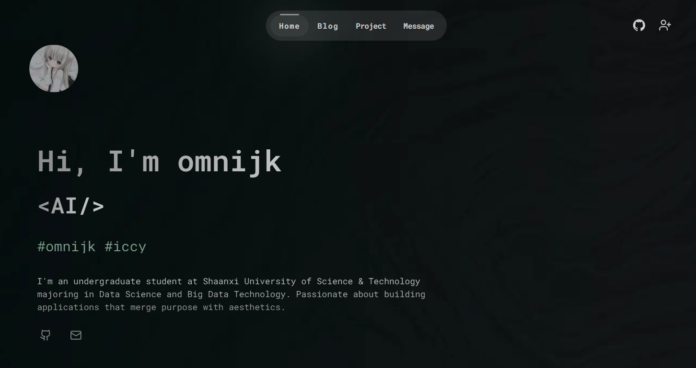
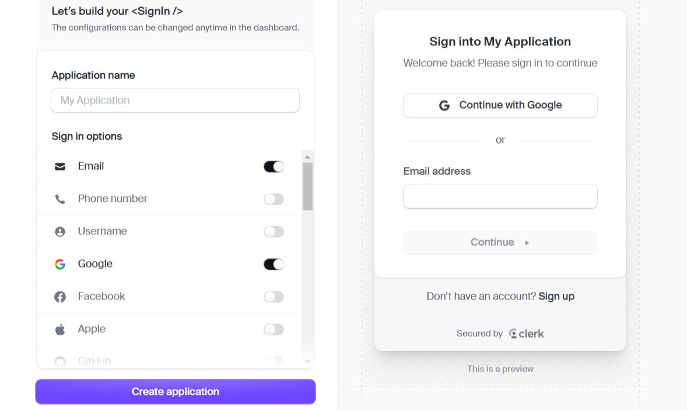
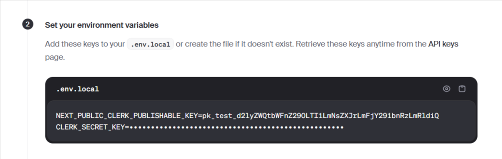
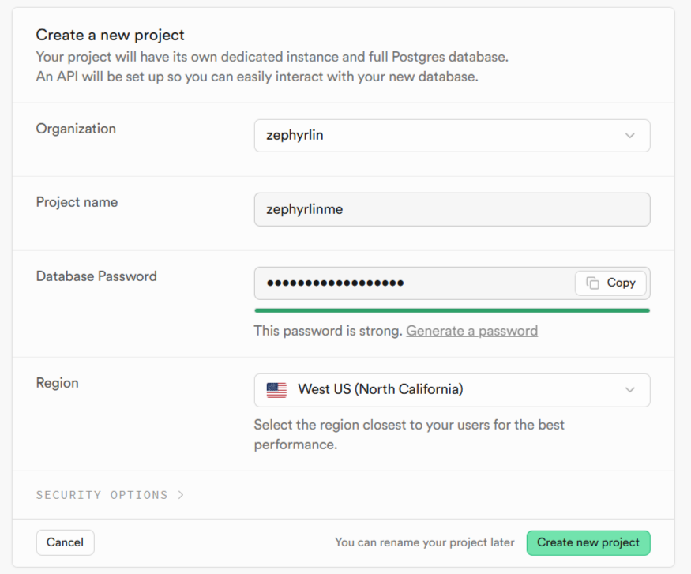
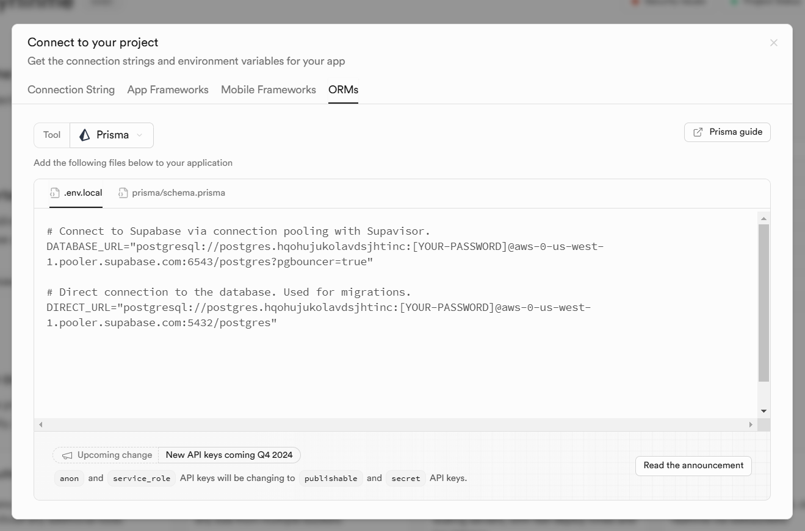
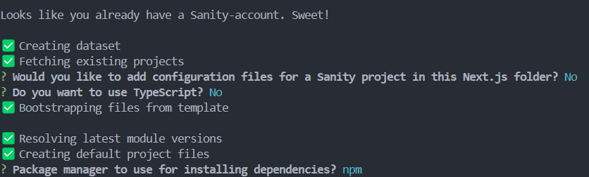
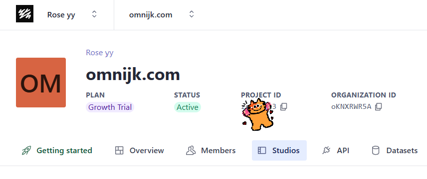

<h1 align="center">omnijk.com</h1>

<p align="center"><a href="../../README.md">English</a></p>

<p align="center">一个面向开发者的个人网站</p>

<p align="center">
  
  
  
</p>




## ⚙️ 技术栈

- 框架：**React + Next.js**
- 样式：**Tailwind CSS** + **Shadcn UI**
- 动画：**Framer Motion**
- 数据库：**Supabase**
- ORM：**Prisma**
- 会话缓存：**Upstash Redis**
- 内容管理：**Sanity**
- 认证：**Clerk**
- 部署：**Vercel**

## 💡 快速开始

### 环境要求

- 请使用 Node.js 18.18 或更高版本。

### 克隆仓库：

```bash
git clone https://github.com/eurooooo/zephyrlin.me.git
cd zephyrlin.me
```

### 安装依赖：

```bash
npm install
```

### 配置 .env 文件

在项目根目录创建一个 `.env` 文件，填入以下内容：

```
# clerk
NEXT_PUBLIC_CLERK_PUBLISHABLE_KEY=
CLERK_SECRET_KEY=

# supabase
DATABASE_URL=
DIRECT_URL=

# sanity
NEXT_PUBLIC_SANITY_ID=

# upstash redis
UPSTASH_REDIS_REST_URL=
UPSTASH_REDIS_REST_TOKEN=

# spotify
SPOTIFY_CLIENT_ID=
SPOTIFY_CLIENT_SECRET=
SPOTIFY_REDIRECT_URI=
SPOTIFY_REFRESH_TOKEN=
```

接下来请按各服务的说明把这些环境变量补充完整。

#### Clerk

1. 前往 Clerk 控制台并创建一个应用，启用 Google 和 GitHub 登录。
   
2. 将生成的环境变量复制到项目根目录的 `.env` 文件中。
   

#### Supabase

1. 前往 Supabase 并新建项目。请妥善保存项目密码，后续需要使用。
   
2. 在项目控制台中点击右上角的 "Connect"，选择 ORMs。
   
3. 将 Supabase 提供的连接字符串等信息填入 `.env` 中，并用第 1 步保存的密码替换占位符。

4. 在终端运行：

```bash
npx prisma db push
```

#### Sanity

1. 创建并登录 Sanity 账号。
2. 在终端运行（可将项目名替换为你喜欢的名称）：

```bash
npm create sanity@latest -- --template clean --create-project "omnijk.com" --dataset production  --output-path sanity
```

3. 按提示登录并初始化项目。
   

4. 在 `sanity/schemaTypes` 文件夹中，将以下代码粘贴到 `index.js`：

```javascript
import { projectsType } from "./project";

export const schemaTypes = [projectsType];
```

在同一目录下新建 `project.js`：

```javascript
import { defineField, defineType } from "sanity";

export const projectsType = defineType({
  name: "project",
  title: "Project",
  type: "document",
  fields: [
    defineField({
      name: "title",
      type: "string",
      validation: (Rule) => Rule.required(),
    }),
    defineField({
      name: "image",
      type: "image",
      validation: (Rule) => Rule.required(),
    }),
    defineField({
      name: "description",
      type: "text",
      validation: (Rule) => Rule.required(),
    }),
    defineField({
      name: "link",
      type: "url",
      validation: (Rule) => Rule.required(),
    }),
    defineField({
      name: "tags",
      type: "array",
      of: [{ type: "string" }],
      validation: (Rule) => Rule.required().min(1),
    }),
  ],
});
```

5. 在 Sanity 管理后台获取项目 ID，并将其填入 `.env` 的 `NEXT_PUBLIC_SANITY_ID`。
   
6. 在终端运行：

```bash
cd sanity
npm run dev
```

7. 打开 [http://localhost:3333](http://localhost:3333) 即可在 Sanity Studio 中管理内容。

#### Spotify（可选）

该功能为新增项，后续会补充详细配置说明。当前若不需要可将 `/app/page.js` 中的 `Spotify` 组件注释掉以避免报错。

### 启动开发服务器

```bash
npm run dev
```

在浏览器中打开 [http://localhost:3000](http://localhost:3000) 查看网站。

## 致谢

- 项目灵感来自 zephyrlin（zephyrlin.me）。
- 感谢 omnifj 的帮助与指导。
